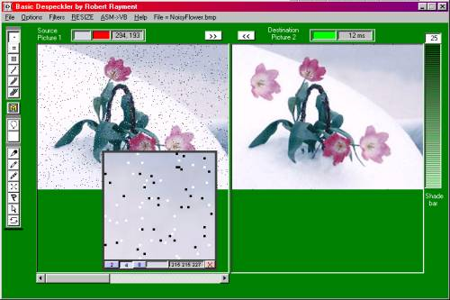



## Despeckler \(VB \+ MMX\)

### Description

Despeckler by Robert Rayment.(Update Re-load added) This attempts to demonstrate some basic patching, dust & scratch removal, de-spotting, pixel painting, sharp, soft, dark & brightening for pictures. The operations can be for the whole picture or a selected area with varying blemish sizes and thresholds. Color selection and a magnifier help with correcting small areas. Example bitmaps are included. Can be run as VB or VB+ASM. The ASM makes extensive use of MMX. 

----

Optionally the use of i_view32.exe (freeware from www.irfanview.com) is demonstrated for loading and saving any image file format in VB....See Notes.txt. 

----

Thanks to VBAccelerator.com (Dialog class), VBSpeed (Timer class) and Ulli (ToolTips class - PSC CodeId=42051) (Exe tested on WinXP) Win98, Zip 205KB.
 
### More Info
 
Pictures

Just run & read notes

             |
---                |---
**Submitted On**   |2003-02-10 18:23:34
**By**             |[Robert Rayment](https://github.com/Planet-Source-Code/PSCIndex/blob/master/ByAuthor/robert-rayment.md)
**Level**          |Advanced
**User Rating**    |5.0 (40 globes from 8 users)
**Compatibility**  |VB 6\.0
**Category**       |[Graphics](https://github.com/Planet-Source-Code/PSCIndex/blob/master/ByCategory/graphics__1-46.md)
**World**          |[Visual Basic](https://github.com/Planet-Source-Code/PSCIndex/blob/master/ByWorld/visual-basic.md)
**Archive File**   |[Despeckler1543572132003\.zip](https://github.com/Planet-Source-Code/robert-rayment-despeckler-vb-mmx__1-43088/archive/master.zip)

### API Declarations

See code

